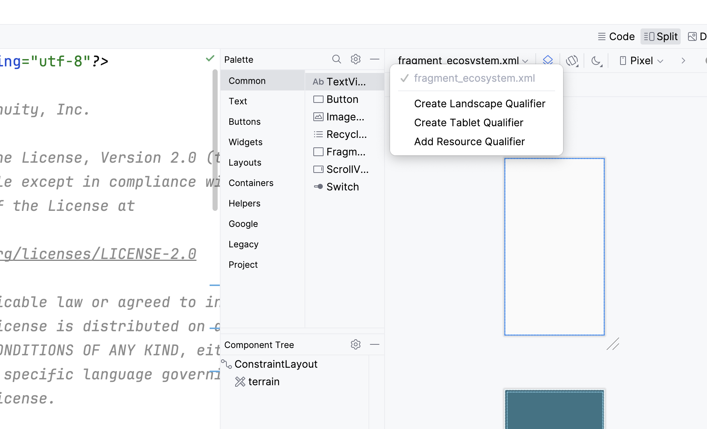
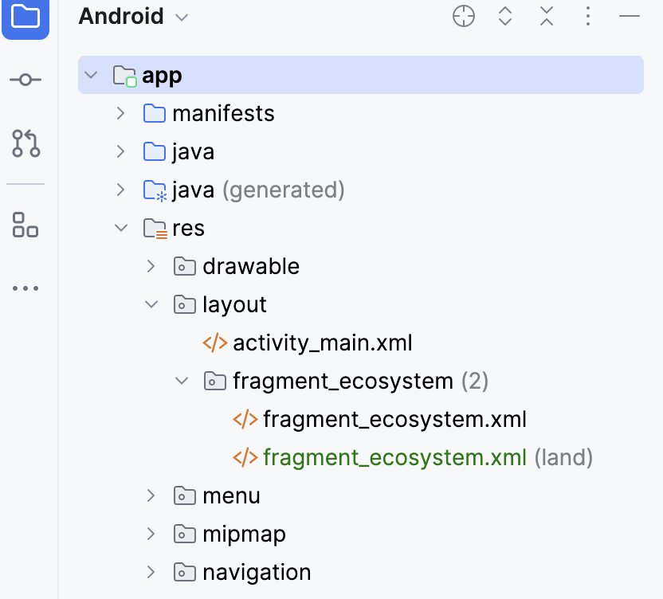
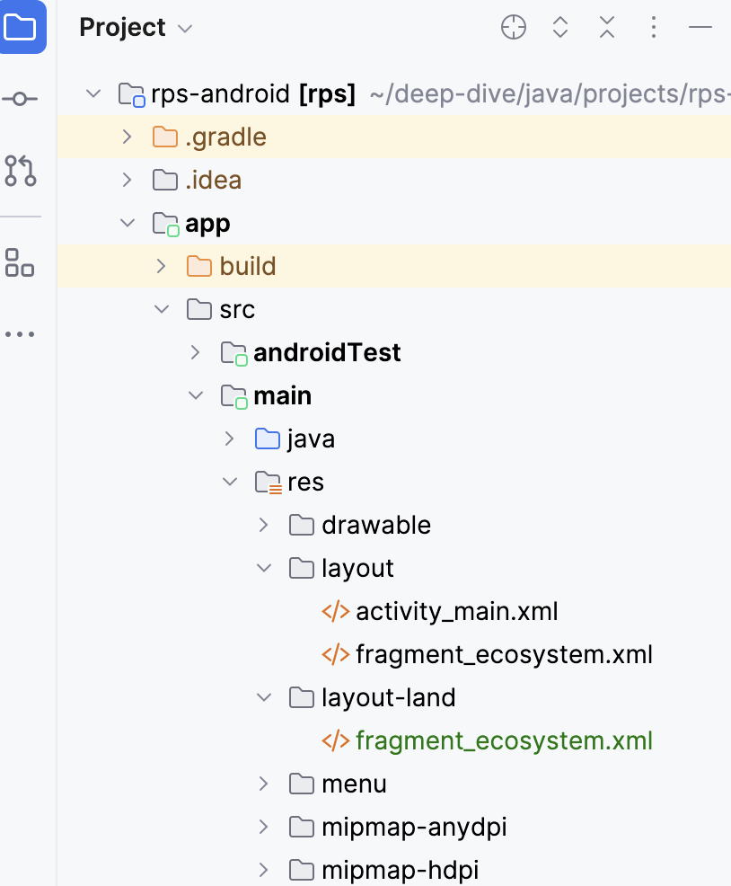
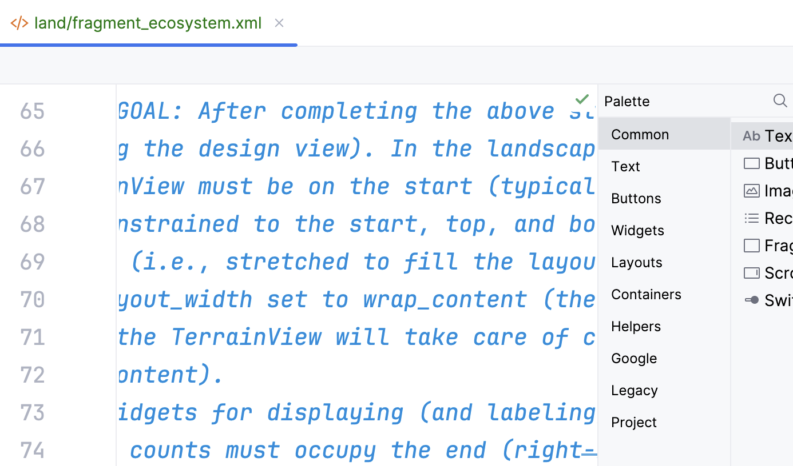



## Overview

As soon as you implement the animated rendering of the terrain, you'll notice that the display doesn't work very well when the device is rotated to the landscape orientation. This is bad enough; worse, when running on a tablet, landscape is the most commonly used orientation---and we certainly want the app to be usable on a tablet.

For this stretch goal, you must create a landscape variation of the [`fragment_ecosystem`](fragment-ecosystem.md) layout resource. However, this must be done in a way that minimizes any disorientation the user might experience when the contents of a screen are rearranged.  

### Files to add

* Landscape variation of `fragment_ecosystem.xml`

### Existing files to change

_(None)_

## Specifications

As is the case for other elements of this assignment, the `TODO` comments in the source code of the [`fragment_ecosystem`](fragment-ecosystem.md) layout resource include details on this stretch goal. These comments are the detailed instructions and specifications; what follows on this page are simply the instructions for getting started with the creation and editing of the landscape variation of the layout.

## Creating the landscape variation
{: menu="Creating"}

The easiest way to start creating a landscape variation of an existing layour resource is to open the layout in IntelliJ (or Android Studio), and then---in the design or split view---use the pull-down displaying the layout's name to select **Create Landscape Qualifier**. 

This will create the landscape variation of the layout as a copy of the default (portrait) resource---but it won't magically change the layout contents to work well in the landscape orientation. For that, you'll have to edit the layout, as usual.

## Finding the landscape variation in the project
{: menu="Finding"}

Immediately after the landscape variation is created, it will be opened for editing. However, locating it later can be confusing the first few times you do this. 

### Android view

In the Android view of the **Project** tool window, landscape layouts appear in the `app/res/layout` folder, grouped with the default variation (and any others):

### Project view

In the Project view of the **Project** tool window, landscape layouts appear in the `app/src/main/res/layout-land` folder:

### Editor tab

When a landscape variation of a layout resource file is open for editing in IntelliJ or Android Studio, the name that appears in the editor tab at the top of the editing area has the `land/` prefix:

